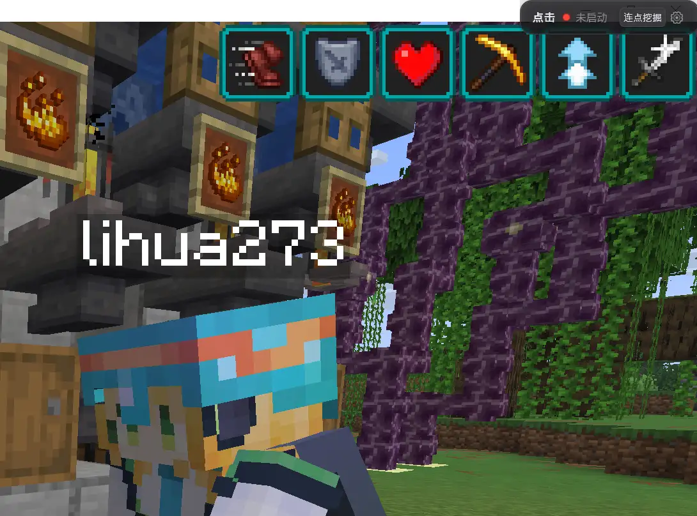
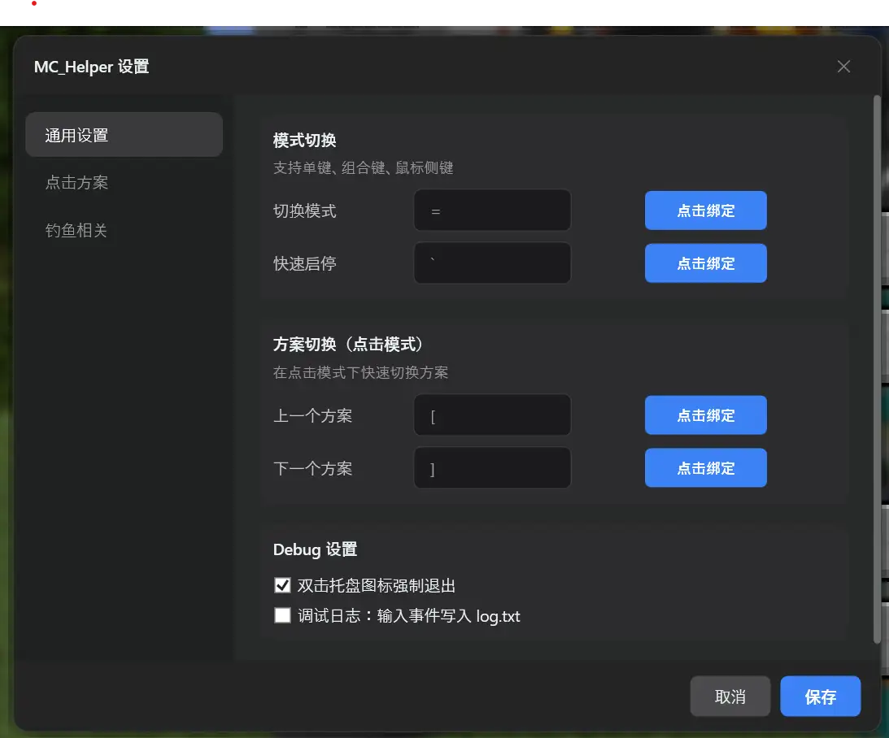

# MC_Helper

Minecraft 辅助工具——悬浮窗 + 全局快捷键，适用于自动钓鱼和自动化点击。

## 图示


感谢好基友礼花出镜（未征得本人允许
Special thanks to lihua273 for volunteering as the in-game model.


## 特性

### 🎣 自动钓鱼
- OCR 识别浮漂状态（甩出 / 溅起水花 / 收回），自动完成抛竿 → 收杆 → 再抛竿循环
- 支持自定义触发短语阈值和截取区域（百分比适配不同分辨率）
- 可选的**自动更换鱼竿**：检测到"物品损坏"自动切换到下一根竿

### 🖱️ 自动点击
- **连点模式**：可调间隔（按下时长 + 间隔），支持左/右键
- **长按模式**：持续按住鼠标
- 4 个内置预设：挂机砍怪（定时按左键）、长按挖掘（长按左键）、破基岩（右键高速连点放置，需配合活塞和tnt等）、树场种植（长按右键）
- 支持自定义添加 / 编辑 / 删除方案

### ⌨️ 全局快捷键
- 支持单键、组合键（Ctrl / Shift / Alt / Win）、鼠标侧键（X1/X2）
- 浮动窗口边缘吸附（拖拽到屏幕边缘 50px 内自动贴边）
- `Ctrl + `` 显示 / 隐藏窗口（隐藏时静默，不干扰游戏）
- 系统托盘图标，双击强制退出

## 使用方法

### 启动
1. 运行 `MC_Helper.exe`
2. 悬浮窗默认吸附在屏幕右上角
3. 系统托盘会出现图标
> ⚠️ **独占全屏模式下悬浮窗不可见**。请"窗口化"游玩。

### 快捷键（默认）

| 快捷键 | 功能 |
| --- | --- |
| `=` | 切换模式（点击 ↔ 钓鱼） |
| `Ctrl + `` | 显示 / 隐藏悬浮窗 |
| `` ` `` | 启动 / 停止当前模式 |
| `[` / `]` | 上一个 / 下一个点击方案 |

可在设置 → 常规 → 模式切换中重新绑定。鼠标侧键（X1/X2）也支持。

### 钓鱼模式
1. 按 `=` 切换到"钓鱼"模式
2. 按 `` ` `` 开始自动钓鱼
3. 首次使用建议在设置中调整截取区域（打开 Debug 覆盖层查看识别效果）

### 点击模式
1. 按 `=` 切换到"点击"模式
2. 按 `[` / `]` 选择方案
3. 按 `O` 启动 / 停止
   - 普通方案：切换开关
   - **破基岩**：按住 `` ` `` 启动，松手即停
4. 在设置中可自定义方案（名称、左/右键、间隔、触发方式）

>  `` ` `` 键一般位于数字1的左侧，tab的上方，它同时也是波浪键 `` ~ ``。当然，您可在设置更改该键位

### 已知问题
1. 当前以溅起水花作为浮漂状态的检测，但鱼在水中游动时同样会产生该字幕。会影响错误处理（例如勾到生物无法收回鱼竿了）
- 解决办法：尽量远离水域或者将自身垫高，确保只有鱼漂的溅起水花能出现在字幕中

## 系统要求

- Windows 10 / 11（64 位）
- 仅下载使用无需安装 .NET 运行时（已内置在 exe 中）
- Minecraft Java Edition（窗口化全屏模式）
- 需要中文ocr包 - 一般中文用户自带

### 环境验证

1. 右键左下角的Windows徽标，选择 Windews Powershell(管理员) 打开命令行工具
2. 复制以下内容，回车。
```powershell
Get-WindowsCapability -Online | Where-Object { $_.Name -Like 'Language.OCR*zh*' }
```
3. 如果 "Name  : Language.OCR~~~zh-CN~0.0.1.0"
显示为 "State : Installed"
说明已安装OCR包

## 项目结构

```
MC_Helper/
├── MC_Helper.csproj          # 项目文件 (.NET 8.0 WPF)
├── App.xaml / .cs            # 应用入口，启动流程、热键注册、鼠标钩子
├── MainWindow.xaml / .cs     # 主悬浮窗，模式切换、边缘吸附
├── img.ico                   # 托盘图标
│
├── Models/                   # 数据模型
│   ├── RootSettings.cs       # 顶层设置（序列化到 settings.json）
│   ├── ModeSettings.cs       # 模式切换快捷键
│   ├── ClickToolSettings.cs  # 点击方案、行为模式、触发方式
│   ├── FishingSettings.cs    # 钓鱼 OCR 区域、短语、换竿配置
│   └── KeyBinding.cs         # 按键绑定（键盘/组合键/鼠标侧键）
│
├── Services/                 # 核心逻辑
│   ├── ModeManager.cs        # 模式状态机（点击/钓鱼切换、启停）
│   ├── ClickTool.cs          # 自动化点击（连点/长按，SendInput）
│   ├── DetectionLoop.cs      # 钓鱼主循环（OCR → 状态机 → 抛收竿）
│   ├── FishingStateMachine.cs# 钓鱼状态机（甩出→溅起水花→收回）
│   ├── OcrService.cs         # Windows OCR 封装
│   ├── ScreenCapture.cs      # 屏幕区域截图
│   ├── CaptureRegionHelper.cs# 百分比 ↔ 像素坐标转换
│   ├── InputService.cs       # SendInput 鼠标/键盘事件封装
│   ├── LowLevelHook.cs       # WH_MOUSE_LL 全局鼠标钩子（仅侧键）
│   ├── RodSwitchService.cs   # 自动换竿逻辑
│   └── SettingsService.cs    # JSON 序列化/反序列化
│
├── Panels/                   # 嵌入悬浮窗的面板
│   ├── ClickToolPanel.xaml   # 点击模式 UI（方案选择、状态显示）
│   ├── FishingPanel.xaml     # 钓鱼模式 UI（启动、选区按钮）
│   └── FishingOverlay.xaml   # 钓鱼半透明覆盖层（选区域、Debug 显示）
│
├── Helpers/                  # 工具类
│   ├── Win32.cs              # P/Invoke 声明（RegisterHotKey、SendInput 等）
│   ├── Logger.cs             # 文件日志
│   └── TrayIcon.cs           # 系统托盘封装
│
├── SettingsWindow.xaml / .cs # 设置窗口（常规/点击/钓鱼三页）
└── PresetEditDialog.xaml / .cs # 点击方案编辑弹窗
```

## 构建

```bash
# 需要 .NET 8.0 SDK
dotnet build -c Release
```

发布单文件：

```bash
dotnet publish -c Release -r win-x64
```

## 安全说明

- 本工具通过 `SendInput` API 模拟鼠标事件，游戏将视为真实输入
- 不会修改游戏内存，不会注入游戏进程


## 画饼

### 1. 坐标工具  规划中ing...
- F3调试模式下可识别并保存当前坐标
- 实时计算主世界/地狱对应坐标
- 双坐标（主世界/地狱）保存

### 2. 录制模式

- 可能不会做，先画饼
